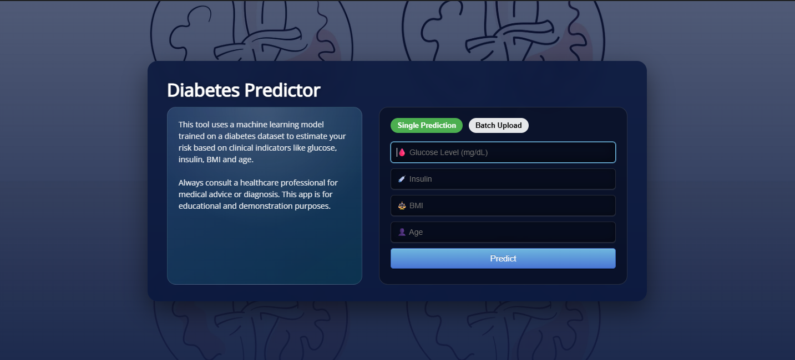

# Diabetes Predictor

> Predict Diabetes using Machine Learning.

In this project, our objective is to predict whether the patient has diabetes or not based on various features like **Glucose level, Insulin, Age, BMI**. We perform all the steps from **Data gathering to Model deployment**. During model evaluation, we compare various machine learning algorithms on the basis of accuracy score and find the best one. Then we create a web app using Flask which is a Python micro framework.

---

# Screenshot



---

# Installation

- Clone this repository and unzip it.

- Open the project folder in VS Code.

## 1. Navigate to the project directory

```bash
cd Diabetes-Prediction-master
```

## 2. Create a virtual environment (only if venv does NOT exist)

```bash
python -m venv venv
```

## 3. Activate the virtual environment

```bash
.\venv\Scripts\activate
```

## 4. Upgrade pip

```bash
python -m pip install --upgrade pip
```

## 5. Install required packages

```bash
pip install flask scikit-learn numpy pandas
```

```bash
pip install -r requirements.txt
```

- If you get any error, redirect to the flask directory:

```bash
cd Diabetes-Prediction-master/flask
```

## 6. Train the model (must be run ONCE)

```bash
python trainmodel.py
```

- If you still get any error, again redirect to:

```bash
cd Diabetes-Prediction-master/flask
```

Then run:

```bash
python trainmodel.py
```

```bash
python model.py
```

## 7. Start the Flask server

```bash
python app.py
```

- Open the following link in your browser:

```bash
http://127.0.0.1:5000/
```